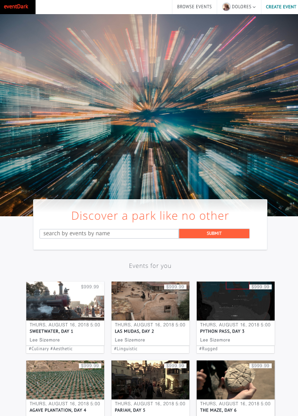
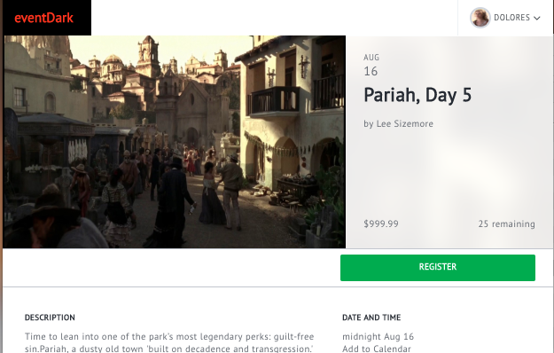

---
**eventdark** is a full-stack web product cloning eventbrite.com, and using thematic content from HBO's WestWorld to flesh out the sites features and branding potential. **eventdark** is a responsively designed single-page web app built from the backend with Ruby on Rails 5.2 RESTful routes API on top of a PostgreSQL object-relational database supplemented with ActiveStorage/Amazon Web Services cloud storage for image files. The **eventdark** web app's frontend uses Reactjs-Reduxjs architecture bundled by webpack 4.0 and npm. Entire site was designed from scratch and completed in 12 days.

Features
---
- Users can browse events by category and search by event name:

- Site uses is mobile-first reponsive based burely on native css design, including css flex and grid properties
- User account creation and user session authentication using BCrpyt encryption
- Users can become event organizers: creating and editing their own events
- Events contain images and descriptions, dates and times:

- Users can register for events and can track the events for which they have tickets
- Events dynamically track availability based on new registrations and preset capacity

Future implementations
---
- Expand user-as-organizer features to include organizer profiles, accessing information about incoming registrations, and see which users have registered
- Expand event search functions to include search by time and description
- Integrate with Google Maps API to tag events by location and allow location-based event search
- Flesh out futher user tools: bookmarking events for future reference and following a particular event organizer

